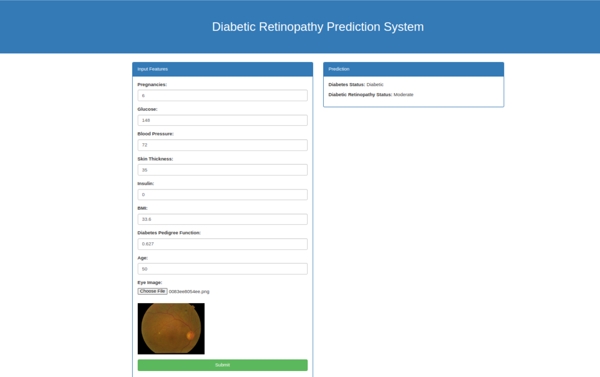

# <div align='center'>Diabetic Retinopathy Prediction 🚀</div>

## Overview

The objective of this project is to develop a computer vision application capable of detecting signs of diabetes and diabetic retinopathy from retinal images. By leveraging advanced image processing techniques and machine learning algorithms, the system aims to assist healthcare professionals in early diagnosis and monitoring of diabetic patients.

## Example




## Workflows

1. Update config.yaml
2. Update secrets.yaml [Optional]
3. Update params.yaml
4. Update the entity
5. Update the configuration manager in src config
6. Update the components
7. Update the pipeline


## Dataset

Here, I have used two datasets.
1. For diabetes prediction [this](https://www.kaggle.com/datasets/mrsimple07/diabetes-prediction)
2. For diabetic retinopathy detection [this](https://www.kaggle.com/competitions/aptos2019-blindness-detection) 

You can use your own dataset. Just replace the URL of the dataset in `config/config.yaml/data_ingestion/ml_data_source_url` and `config/config.yaml/data_ingestion/source_URL`


## <div style="padding-top: 20px" align="center"> Steps to run </div>

<div style="padding-bottom:10px"><b>STEP 00 :</b> Clone the repository</div>

```bash
https://github.com/utpalpaul108/Diabetic-Retinopathy-Prediction
```
<div style="padding-top:10px"><b>STEP 01 :</b> Create a virtial environment after opening the repository</div>

Using Anaconda Virtual Environments

```bash
conda create -n venv python=3.10 -y
conda activate venv
```
Or for Linux operating system, you can use that

```bash
python3.10 -m venv venv
source venv/bin/activate
```

<div style="padding-top:10px; padding-bottom:10px"><b>STEP 02 :</b> Install the requirements</div>

```bash
pip install -r requirements.txt
```

Finally, run the following command to run your application:
```bash
python app.py
```

<div style="padding-top:10px"><b>STEP 03 :</b> Run the application</div>

Now,open up your local host with a port like that on your web browser.
```bash
http://localhost:8080
```
<div style="padding-top:10px"><b>STEP 04 :</b> Train the model</div>

Before predicting, you have to train the models with your own dataset.
```bash
http://localhost:8080/train-diabetes-prediction-model
http://localhost:8080/train-diabetic-retinopathy-prediction-model

```
After completing the training, you can now predict the signs of diabetes and diabetic retinopathy from retinal images.
```bash
http://localhost:8080
```


	
